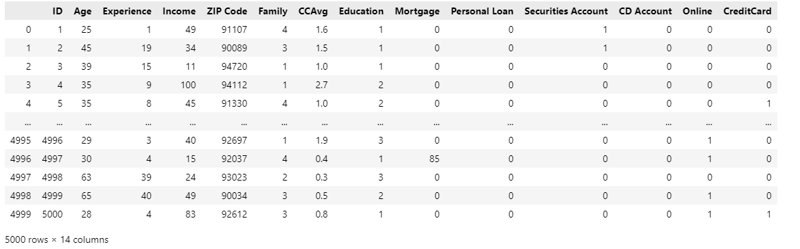

# Business-Analytics_2, Kernel-based Learning 

## Tutorial Purposes
***
1. Apply kernel-based learning algorithms to real-world dataset.
2. Understand how the algorithm wrosk while implementing it. 
3. Explain about the result from algorithms with the knowledge of data 


## Dataset
***

### SVM Dataset

Universal bank dataset

Data Link: https://www.kaggle.com/datasets/lowecoryr/universalbank



-> [Data EDA](https://github.com/goeunchae/Business-Analytics_2/blob/main/EDA_UniversalBank.ipynb)


### SVR Dataset

Medical cost personal dataset

Data Link: https://www.kaggle.com/datasets/mirichoi0218/insurance/discussion


-> [Data EDA](https://github.com/goeunchae/Business-Analytics_2/blob/main/EDA_UniversalBank.ipynb)


## SVM (Suppoer Vector Machine)
***
### Purpose
1. Conduct SVM from scratch code to universal bank dataset and search the best hyperparameter setting.
2. Conduct SVM with sklearn packages according to kernel types. 
3. Conduct SVM after PCA for comparision. 
3. Compare above results with KNN classifier result.

### SVM from scratch 

We applied SVM without sklearn to universal bank datase. 

**SVM class**
```
class SVM:

    def __init__(self, learning_rate, lambda_param, n_iters):
        self.lr = learning_rate
        self.lambda_param = lambda_param
        self.n_iters = n_iters
        self.w = None
        self.b = None


    def fit(self, X, y):
        n_samples, n_features = X.shape
        
        y_ = np.where(y <= 0, -1, 1)
        
        self.w = np.zeros(n_features)
        self.b = 0

        for _ in range(self.n_iters):
            for idx, x_i in enumerate(X):
                condition = y_[idx] * (np.dot(x_i, self.w) - self.b) >= 1
                if condition:
                    self.w -= self.lr * (2 * self.lambda_param * self.w)
                else:
                    self.w -= self.lr * (2 * self.lambda_param * self.w - np.dot(x_i, y_[idx]))
                    self.b -= self.lr * y_[idx]


    def predict(self, X):
        approx = np.dot(X, self.w) - self.b
        return np.sign(approx)
```

**hyperparameters**
```
lr = [5e-3, 1e-3, 5e-4, 1e-4]
lambda_params = [0.01,0.03,0.05,0.1]
n_iters = [100, 200, 500, 1000, 2000] 
```

**run SVM from scratch**
```
def run_SVM():
    result = pd.DataFrame()
    for i in lr:
        for j in lambda_params:
            for k in n_iters:
                        
                clf = SVM(i,j,k)
                clf.fit(X_train, y_train)
                y_pred = clf.predict(X_test)
                y_pred = np.where(y_pred <= -1, 0, 1)
                acc = accuracy_score(y_test,y_pred)
                
                acc_lst.append(acc)
                lr_lst.append(i)
                lam_lst.append(j)
                iters.append(k)
                
    result['learning rate'] = lr_lst
    result['lambda parameters'] = lam_lst
    result['n_iters'] = iters
    result['acc'] = acc_lst
                
    result.to_csv('SVM_result.csv',index=False)

run_SVM()
```
**result**


According to the result, the classifier accuracy is the highest with learning rate = 0.0001 and lambda paramter = 0.01. However, we can figure out that number of iters does not affect to the accuracy since top 4 hyperparameter settings have same learning rate and lambda parameter. The only difference was number of iters but the accuracy among them are similar. In addition, accuracy is the lowest with learning rate=0.005 and lambda parameter=0.01. Although it has same lambda parameter value, accuracy is difference because of learning rate and number of iters. Lastly, we demonstrate that number of iters has a less significant impact on accuracy when other parameters are optimal with the top-2 results. Overall, lower learning rate is the most important factor for boosting accuracy in this dataset. 


**run SVM with sklearn**

We builted SVM according to the kernel type

```
from sklearn.svm import SVC

def run_clf(kernel_name):
    clf = SVC(kernel=kernel_name)
    clf.fit(X_train, y_train)
    y_pred = clf.predict(X_test)
    y_pred = np.where(y_pred <= -1, 0, 1)
    acc = accuracy_score(y_test,y_pred)
    return acc      
        
def run_SVM_2():
    
    result = pd.DataFrame()
    acc_lst = []
    for i in ['linear','poly','rbf','sigmoid']:
        acc = run_clf(i)
        acc_lst.append(acc)
    
    result['kernel'] = ['linear','poly','rbf','sigmoid']
    result['acc'] = acc_lst 
    result.to_csv('SVM_result_sklearn.csv',index=False)
    
run_SVM_2()
```

**result with sklearn**


According to this result, we can figure out that there is no difference among kernel types for this dataset. This is because in this dataset, kernel type is not an important hyperparamter. 

**SVM after PCA**

We conducted PCA (principal component analysis) for defining principal components and built SVM with them. 

**PCA visualization**
```
#PCA 
from sklearn.preprocessing import StandardScaler
scaler = StandardScaler()

X_train1 = scaler.fit_transform(X_train)
X_test1 = scaler.transform(X_test)

from sklearn.decomposition import PCA
pca = PCA(n_components=2)
scaler = StandardScaler()

X_train1 = pca.fit_transform(X_train1)
X_test1 = pca.transform(X_test1)

X_train1 = scaler.fit_transform(X_train1)
X_test1 = scaler.transform(X_test1)

plt.figure(figsize=(8,6))
plt.scatter(X_train1[:,0],X_train1[:,1],c=y_train,cmap='plasma')
plt.xlabel('First principal component')
plt.ylabel('Second Principal Component')
plt.savefig('./pics/svm_pca.png')
```

**PCA result**


There is no remarkable difference between classes (y=0,1). We can assume that's why overall classifier accuracy is not that high.

**SVM with principal components**
```
# SVM with principal components (gridsearch)
from sklearn.model_selection import GridSearchCV
param_grid = {'C': [0.01, 0.1, 0.5, 1, 10, 100], 
              'gamma': [1, 0.75, 0.5, 0.25, 0.1, 0.01, 0.001], 
              'kernel': ['rbf', 'poly', 'linear']} 

grid = GridSearchCV(SVC(), param_grid, refit=True, verbose=1, cv=5)
grid.fit(X_train1, y_train)
best_params = grid.best_params_
print(f"Best params: {best_params}") #{'C': 100, 'gamma': 0.1, 'kernel': 'rbf'}

svm_clf = SVC(**best_params)
svm_clf.fit(X_train1, y_train)

y_pred = svm_clf.predict(X_test1)
y_pred = np.where(y_pred <= -1, 0, 1)
acc = accuracy_score(y_test,y_pred)
print(acc) #0.2936
```

The accuracy of SVM with principal components is 0.2936. It is lower than hyperparamter tuned version, but same as default settings (variable kernels). With this result, we can conclude that PCA did not help construct better support vectors for classification.  


**(baseline) K-nearest neighbors classifier**

We conduct standard KNN classifier to compare with SVM accuracy. 

```
# classification for baseline 
from sklearn.neighbors import KNeighborsClassifier
classifier = KNeighborsClassifier(n_neighbors = 5, metric = 'minkowski', p = 2)
classifier.fit(X_train, y_train)

y_pred = classifier.predict(X_test)
acc = accuracy_score(y_test, y_pred)
print(acc)
```
The accuracy of KNN is 0.6592 with number of neighbors is 5. 

Final accuracy table according to different approachs are below.
|approach|accuracy|
|--------|---------|
|hyperparameter tuned SVM| 0.7160|
|KNN classifier| 0.6592|
|SVM after PCA| 0.2936|
|standard SVM| 0.2936|

From this table, we can figure out that hyperparameter tuning is such an important part of SVM and since all accuracy with different kernels were the same, kernel type has no impact on this dataset. 


## SVR (Support Vector Regression)
***

### Purpose 
1. Conduct SVR to insurance dataset and search the best hyperparameter setting through gridsearch.
2. Compare results of 1) with linear regression result.
3. Create new non-linear data and conduct SVR.

**run SVR with sklearn**

We applied SVR to insurance dataset according to kernel types. 
```
# with sklearn 
from sklearn.svm import SVR

def run_clf(kernel_name):
    clf = SVR(kernel=kernel_name)
    clf.fit(X_train, y_train)
    y_pred = clf.predict(X_test)
    r2 = clf.score(X_test,y_test)
    mse = mean_squared_error(y_pred, y_test)
    return r2, mse  
        
def run_SVR():
    
    result = pd.DataFrame()
    mse_lst = []
    r2_lst = []
    for i in ['linear','poly','rbf','sigmoid']:
        r2, mse = run_clf(i)
        mse_lst.append(mse)
        r2_lst.append(r2)
    
    result['kernel'] = ['linear','poly','rbf','sigmoid']
    result['mse'] = mse_lst
    result['r2'] = r2_lst
    result.to_csv('SVR_result_sklearn.csv',index=False)
    
run_SVR()
```

**result with sklearn**


R-square is poor at all kernel types. However, linear kernel records the lowest mse and highest r-square among them. With this result, we can presume that the insurance dataset is close to linear. 

**SVR with gridsearch**

Thus, we conduct gridsearch for finding best hyperparameter setting with linear kernel. 
```
# GridSearch 
from sklearn.model_selection import GridSearchCV

param_grid = [
    {'kernel' : ['linear'], 'C': [10.,30.,100.,300.,1000.,3000.,10000.,30000.],
     'gamma' : ['auto', 0.1, 0.01], 'epsilon' : [0.2, 0.1, 0.05, 0.02, 0.01]
     }]

svm_reg = SVR()

grid_search = GridSearchCV(svm_reg, param_grid, cv=5, scoring = 'r2', verbose=2)
grid_search.fit(X_train, y_train)

print(grid_search.best_params_) # {'C': 3000.0, 'epsilon': 0.01, 'gamma': 'auto', 'kernel': 'linear'}

svr_best = SVR(kernel='linear', C=3000, epsilon=0.01, gamma='auto')
svr_best.fit(X_train,y_train)

y_pred = svr_best.predict(X_test)
r2 = svr_best.score(X_test,y_test)
mse = mean_squared_error(y_pred, y_test)
print(r2,mse) # 0.7060211957639762 48733657.34117352
```
The best hyperparameter setting is C: 3000, epsilon=0.01, gamma=auto. <br>
R-square is about 0.7 with the best hyperparameters and it is much higher than the previous result. Similar to SVM, hyperparameter tuning in SVR has a significant role in elevating prediction accuracy. <br>
R-square is the highest when epsilon has the lowest value. Epsilon in SVR specifies the epsilon-tube within which no penalty is associated in the traininig loss function with points predicted within a distance epsilon from the actual value. In fact, with larger epsilon, the model constructs a flatter regression model. Therefore, in contrast, the non-flat model with a low epsilon value can predict insurance charges accurately on the insurance dataset. 


**(baseline) linear regression**

Since we presumed this dataset is close to linear, we conduct linear regression to compare with SVR performance. 

```
from sklearn.linear_model import LinearRegression 
linear = LinearRegression()

linear.fit(X_train,y_train)
y_pred = linear.predict(X_test)
r2= linear.score(X_test,y_test)
mse = mean_squared_error(y_pred, y_test)
print(r2, mse) # 0.7944038492696281 34082227.07210547
```

r-squared and mse of linear regression are 0.7944 and 34082227.07210


Final accuracy table according to different approachs are below.
|approach|mse|
|--------|---------|
|SVR with linear kernel|-0.0018|
|hyperparameter tuned SVR| 0.7060|
|linear regression| 0.7944

Since linear regression has the highest r-square, we can conclude that SVR model is not suitable on this insurance dataset. Therefore, we decided to apply SVR on  created non-linear dataset. 


**create new non-linear dataset for SVR**
```
X = np.sort(10*np.random.rand(100,1), axis=0) 
y = np.sin(X).ravel()                         

y[::5] +=2*(0.5-np.random.rand(20))           
y[::4] +=3*(0.5-np.random.rand(25))
y[::1] +=1*(0.5-np.random.rand(100))
```


With this picture, we can see that this data is clearly non-linear. 

**SVR with non-linear dataset**
```
def run_SVR_1():
    
    result = pd.DataFrame()
    mse_lst = []
    r2_lst = []
    for i in ['linear','poly','rbf','sigmoid']:
        r2, mse = run_clf(i)
        mse_lst.append(mse)
        r2_lst.append(r2)
    
    result['kernel'] = ['linear','poly','rbf','sigmoid']
    result['mse'] = mse_lst
    result['r2'] = r2_lst
    result.to_csv('SVR_result_nonlinear.csv',index=False)
    
run_SVR_1()
```

**result with non-linear dataset**


R-square is the highest with RBF kernel because the dataset is non-linear. Since the RBF kernel works well on non-linear data, the result is reasonable. 


**SVR with gridsearch with non-linear dataset**
```
from sklearn.model_selection import GridSearchCV

def grid2():
    param_grid = [
        {'kernel' : ['rbf'], 'C': [10.,30.,100.,300.,1000.,3000.,10000.,30000.],
        'gamma' : ['auto', 0.1, 0.01], 'epsilon' : [0.2, 0.1, 0.05, 0.02, 0.01]
        }]

    svm_reg = SVR()

    grid_search = GridSearchCV(svm_reg, param_grid, cv=5, scoring = 'r2', verbose=2)
    grid_search.fit(X_train, y_train)

    best_params = grid_search.best_params_
    print(grid_search.best_params_) # {'C': 10.0, 'epsilon': 0.2, 'gamma': 0.1, 'kernel': 'rbf'}

    svr_best = SVR(**best_params)
    svr_best.fit(X_train,y_train)

    y_pred = svr_best.predict(X_test)
    r2 = svr_best.score(X_test,y_test)
    mse = mean_squared_error(y_pred, y_test)
    print(r2,mse) # 0.5801512939031991 0.32302460305891

grid2()
```
The best hyperparameter setting is C: 10, epsilon=0.2, gamma=0.1, kernel=rbf <br>
R-square is about 0.58 with the best hyperparameters. 
Similar to previous result, larger epsilon is the optimal with RBF kernel. Therefore, the non-flat model with a low epsilon value can predict insurance charges accurately on the insurance dataset. <br>
In addition, C is the regularization parameter and the strength of the regularization is inversely proportional to C. Since we have the highest r-square when C is the lowest, it means the error is strictly regulated. 

